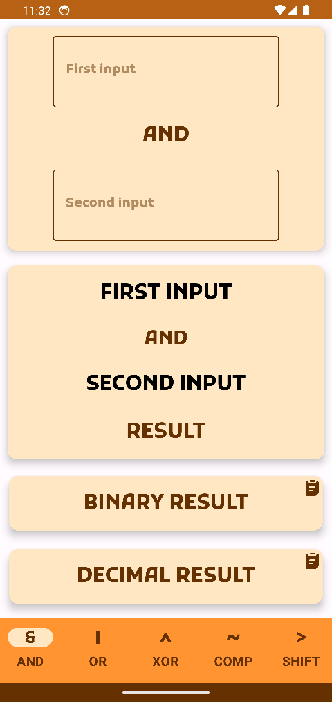
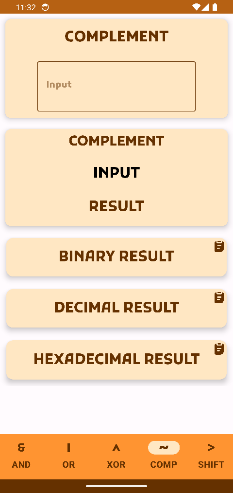
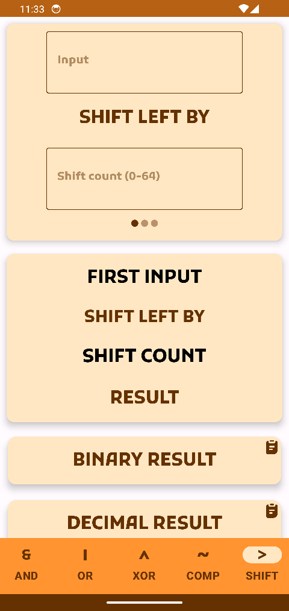

# Bit Manipulation Gadget

## Description
An Android application that provides solutions to most common bitwise operations in low level
programming.

## Installation
An apk is provided in the release section.

## Screenshots
  

## Development
The repository can be opened in Android Studio directly.